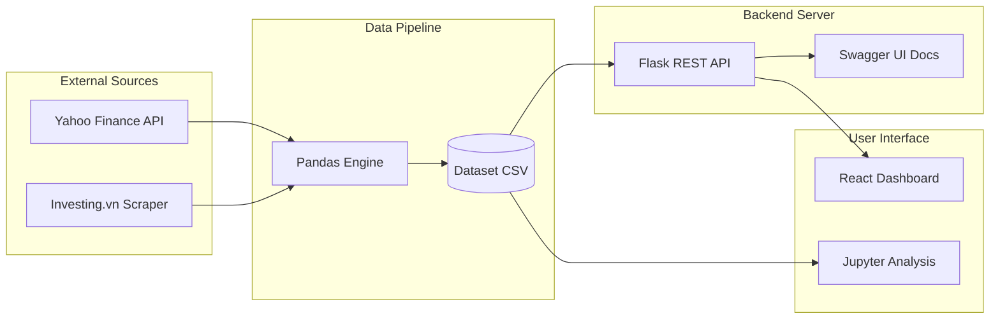

# 🥈 SILVER PROJECT: Vietnam Silver Price Analysis & Prediction

[](https://www.python.org/)
[](https://reactjs.org/)
[](https://vitejs.dev/)
[](https://flask.palletsprojects.com/)
[](https://pandas.pydata.org/)
[](https://swagger.io/)

Silver Project is a comprehensive fintech solution designed to track, analyze, and forecast silver price trends in the Vietnamese market from 2023 to 2025. It combines the power of algorithmic **Web Scraping**, **Quantitative Data Analysis**, and a **Full-Stack Web Application** to provide real-time and historical insights for investors.

---

## 🏛️ System Architecture

Our robust system architecture automates data synchronization between global markets and domestic interfaces.



---

## 📂 Project Structure

```text
PDS301m/
├── Project/
│   ├── backend/                # Flask API, OpenAPI, & Data Processing
│   │   ├── app/                # Core Logic (Routes, Services)
│   │   ├── Analysis_Notebook.ipynb # Jupyter Notebook (Detailed Analysis)
│   │   ├── Analysis_Report.md  # Final Analytical Insights Report
│   │   ├── data_collection.py  # Pandas data aggregation script
│   │   └── run.py              # WSGI Entry Point
│   └── frontend/               # React Vite Application
│       ├── src/                # Modern User Interface & Dashboard
│       └── package.json
├── START_PDS.py                # Automated multi-process launcher
└── README.md                   # Documentation
```

---

## 🚀 Quick Start Guide

The entire multi-process stack can be seamlessly booted using the automated Python entry point:

```bash
# In the root directory
python START_PDS.py
```

### Manual initialization:

1. **Start the API Server:**
   ```bash
   cd Project/backend
   pip install -r requirements.txt
   python run.py
   ```

2. **Start the UI Client:**
   ```bash
   cd Project/frontend
   npm install
   npm run dev
   ```

---

## 🌐 OpenAPI Capabilities

The backend supplies 9 powerful RESTful API endpoints. For interactive testing and endpoint exploration, the system automatically hosts a live Swagger playground.
**Visit:** `http://localhost:5000/apidocs` once the server initiates.

### Core Data Delivery
| Endpoint | Method | Action |
| :--- | :---: | :--- |
| `/api/silver-price` | `GET` | Retrieve the latest real-time domestic calculations. |
| `/api/silver-history` | `GET` | Pull large-scale 2-year formatted historical matrices. |
| `/api/silver-weekly` | `GET` | Aggregate daily prices for the last 7 trailing days. |
| `/api/market/histogram` | `GET` | Fetch price band distributions for volatility checks. |
| `/api/market/branded` | `GET/POST` | Extrapolate competitive pricing among top VN brands. |
| `/api/market/insights`| `GET` | Query high/low records and unique data markers. |

### Computation Engines
| Endpoint | Method | Action |
| :--- | :---: | :--- |
| `/api/calculate/conversion`| `POST`| Cross-calculate varying purity units (Tael, Chi, Oz).|
| `/api/calculate/risk` | `POST`| Assess bid-ask spread liquidity dangers. |
| `/api/calculate/investment`| `POST`| Output a comparable ROI against localized bank yields.|
| `/api/calculate/breakeven` | `POST`| Return the target exit price for profitability. |

---

## 👥 Contributors
Developed by a tight-knit software engineering duo to deliver actionable financial analytics.
- **Trinh Vu** - [trinhhvu](https://github.com/trinhhvu)
- **Tuan Anh** - [Tani2409](https://github.com/Tani2409)
